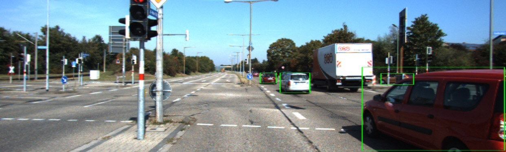

Image 1: Bounding box detection result of an image in the KITTI dataset

Our project consists of detecting the 2D bounding box locations of cars using 2D images. We aim to reproduce the results for object detection using the CenterNet framework, which uses keypoint estimation to determine the center point of the object, in the KITTI data set. Our results show that the model performs fairly well in detecting the locations of cars in the KITTI dataset, achieving similar performance as what is presented in the original CenterNet paper.

Object detection from 2D images is a very relevant and rapidly advancing problem as of today. It has many applications in the development of autonomous systems, and most notably, self-driving cars. An effective object detection system should be accurate, fast, and robust to change in relative positions, viewing angles, lighting, truncations, and occlusions. Humans instantly recognize their surrounding objects and  can  estimate the position of objects without any explicit measurement. Therefore, it is intellectually interesting and practical to investigate how a deep learning model would perform in the task of detecting objects from 2D images.

The CenterNet framework models the object as a single point,which is the center of the bounding box of the object in theimage. CenterNet first uses keypoint estimation to find centerpoints. The image is fed into a fully-convolutional encoder-decoder network, and the output is a heatmap for each classwith values between \[0,1]. Peaks in the heatmap correspond to object centers. Once the keypoint detection heatmap is generated, otherproperties, such as the bounding box of the object, are thenregressed from the image features at the center location. Theregression shares the same fully-convolutional backbone withthe keypoint estimator with a separate regression head foreach property.

We will use the KITTI 3D Vision Benchmark Suite. The dataset is already labeled and has a size of 24 GB. The KITTI dataset is compiled for autonomous driving development. The images of the KITTI dataset consist of mainly outdoor roads scenes, with a lot of cars and other objects like pedestrians and houses. The training set is 80% of the whole dataset while the validation is 20% of the whole dataset. For the evaluation, the CenterNet paper uses 2D bounding box average precision (AP). We directly use the 3D detection evaluation criterion proposed by KITTI benchmark. The KITTI benchmark evaluation criterion has three levels of difficulty: Easy, Medium, and Hard. The AP results of the CenterNet on the KITTI dataset in the paper is around 90 for Easy, around 80 for Medium, and 70 for Hard. We aim to at least match and possibly exceed these results.