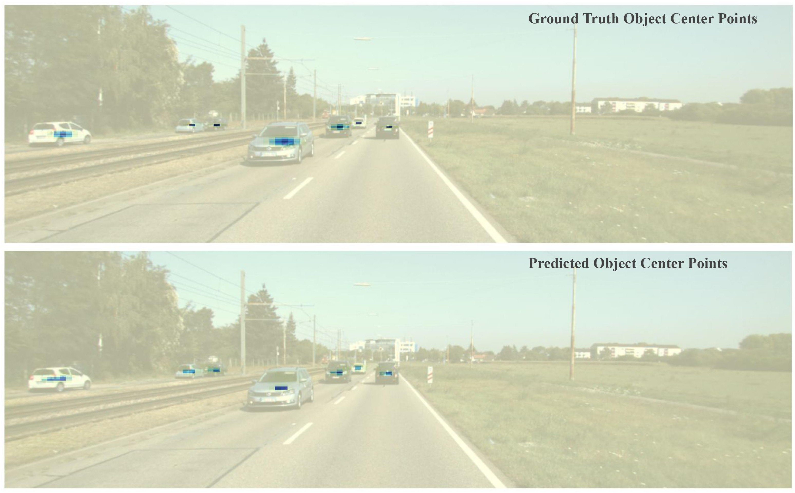

*Northwestern University, Fall 2020 CS 496 Deep Learning Final Project.*

*Instructor: Prof. Bryan Pardo.*

*Team Members: Tianfu Wang (tianfuwang2021@u.northwestern.edu), Shangzhou Ye (shangzhouye2020@u.northwestern.edu)*

## Demo

Bounding box detection result of an image in the KITTI dataset

Predicted heatmap of object center points on an image from the validation set.

## Abstract

We implemented CenterNet \[1] from scratch for 2D object detection and tested on [KITTI dataset](http://www.cvlibs.net/datasets/kitti/eval_object.php?obj_benchmark=2d). We aimed to reproduce the results as what is presented in the original [CenterNet](https://arxiv.org/pdf/1904.07850.pdf) paper. The model represents each object as a single point - the center point of the 2D bounding box. DLA-34 \[2] is used as our backbone for center point estimation, and other object properties including width and length of the bounding box are regressed from the center point. We achieved 92.10% AP for easy objects, 86.72% AP for moderate objects and 78.73% AP for hard objects respectively. The performance of our implementation is similar to the original CenterNet paper.

Our paper is at this [link](https://drive.google.com/file/d/1X2eLGzWRkYKiVJedTTP_CDeV3Lp2jgI5/view?usp=sharing), and our code is on github [here](https://github.com/shangzhouye/centernet-detection-kitti). 

## The Problem

The goal of our final project is to train a model that accurately detects the 2D location of cars from 2D images. We use the KITTI dataset to predict the object’s bounding box location in the image pixel space. We aim to reproduce the result from the CenterNet paper.

## Introduction and motivation

Object detection from 2D images is a very relevant and rapidly advancing problem as of today. It has many applications in the development of autonomous systems, and most notably, self-driving cars. In order to build automation system that properly and responsively react to its surroundings, it needs a vision system that achieves object detection that is accurate, fast, and robust to change in relative positions, viewing angles, lighting, and occlusions. Humans instantly recognize their surrounding objects and  can  estimate the position of objects without any explicit measurement. Therefore, it is intellectually interesting and practical to investigate how a deep learning model would perform in the task of detecting objects from 2D images.

## Previous Work

One of the first successful attempts to use a deep network in object detection is RCNN\[3], which crops certain region candidates of the image and apply classification through a deep network. However, such methods are very slow since the set of possible candidate region is very large to enumerate.

Keypoint estimation is a technique in used mainly in human pose estimation to detect the location of human joint locations. One popular approach is the stacked hourglass model \[4], which used repeated bottom-up, top-down  the successive steps of pooling and upsampling that captures the image information on multiple scales to achieve keypoint detection. 

Before CenterNet, keypoint estimation already been used in the task of object detection. Models such as ExtremeNet \[5] detects the four vertices as well as the center of the bounding box. However, after the keypoint estimation stage, the detected keypoints needs to be grouped to form the final bounding box, and this grouping process is very slow. 

## Network Design

The CenterNet framework \[1] models the object as a single point, which is the center of the bounding box in the image. CenterNet first uses keypoint estimation to find center points. The image is fed into a fully-convolutional encoder-decoder network, and the output is a heatmap for each class with values between \[0,1]. Peaks in the heatmap correspond to object centers. In our project, we use a DLA-34 network \[2] as the backbone for our keypoint estimation system. For our training, the input is the KITTI data set image resized to 512 x 512 pixels. We then calculate the center position *p* of the car objects in the resized image space from the label data, and generate the ground truth heatmap by passing the center keypoint though a Gaussian smoothing kernel, where the intensity value of each pixel is:

A pixel-wise maximum is taken should two Gaussians overlap. A penalty-reduced pixel-wise logistic regression with focal loss is then used for the training.

N is the number of keypoints, and alpha, beta are hyper-parameters for the focal loss \[6].

Once the keypoint detection heatmap is generated, other properties, such as the bounding box of the object, are then regressed from the image features at the center location. The regression shares the same fully-convolutional backbone  with  the  keypoint  estimator with a separate regression head for each property. The loss function for the regression is the L2 loss between the predicted size of the bounding box and the ground truth size of the  bounding box.

Figure 1: An example image in the validation set. (left) Ground truth (right) inference results from our implementation.

## Training and Testing

We use the KITTI \[7] Vision Benchmark Suite. The dataset is already labeled and has a size of 24 GB. The KITTI dataset is compiled for autonomous driving development. The images of the KITTI dataset consist of mainly outdoor roads scenes, with a lot of cars and other objects like pedestrians and houses. It consists of 7481 training images and 7518 test images, comprising a total of 80256 labeled objects. For this project, we focus on object detection for cars only. Because only those 7481 training images have publicly available labels, we random split them into training and validation sets. The training set is 80% of the whole dataset (5984 images) while the validation is 20% of the whole dataset (1497 images). No data augmentation is utilized for our project.

The data consists of 2D RGB images and a corresponding *txt* file for the labels. In the label *txt* file, there are 16 values separated by spaces for each labeled object. The first value is the class in string format, the second value is the “truncated” value, a 0 or 1 value that refers to the object being on the edge of an image. The third value is the “occluded” value, a 0 or 1 value which refers to the object being occluded. The 4th value is the alpha, which is the observation angle of the object, ranging from -pi to pi. The 5th to 8th value is the 2D bounding box. The next 9th to 11th values are the 3D dimensions height, width and length in meters. The next 12th to 14th values are the 3D x, y, z location in meters. The 15th value is the rotation value, the angle of the object with respect to the camera in \[-pi, pi]. Finally, the 16th value is the score, only for predictions, ranging from 0 to 1. We output our prediction in the same format as the labels for evaluation.

For the evaluation, we followed the standard average precision (AP) evaluation criteria proposed in the Pascal VOC benchmark \[8]. A car detection can be counted as true positive only if its overlap with the ground truth bounding box is above 70%. By adjusting the confidence threshold for detection, a precision-recall (PR) curve can be obtained with 40 different recall positions. The AP can then be calculated as the area under the PR curve. We use this calculated average precision value as the measure of the performance of our system. The KITTI benchmark evaluation criterion has three levels of difficulty: Easy, Medium, and Hard  \[7]. The object's minimum bounding box height decreases with increasing difficulty, while the maximum occlusion level and maximum truncation increases with increasing difficulty.

## Results

**Implementation details:** We use 34-layer deep layer aggregation (DLA) network \[2] as our backbone. The heatmap from keypoint estimator has the size of 128 x 128 with an output stride of 4. There is an additional local offset prediction to compensate the decrease in resolution. The weights of heatmap loss, width/height loss and offset loss are 1, 0.1 and 0.1 respectively. We trained with batch-size of 8 (on 1 GPU) and learning rate of 5e-4. The models converges after 3 epochs and start to over-fitting after that.

Table 1: Compare evaluation results of our implementation to the original CenterNet on KITTI.

Table 1 shows our evaluation results compared to the original CenterNet paper. It shows that our implementation is able to achieve similar performance as the original paper. Notice that the original paper follows a 50/50 training and validation split and we are having an 80/20 split. Also, the results of the original paper is based on all classes but we only focused on cars predictions in this project.

Figure 2: (left) Ground truth (right) Predicted heatmap. (bottom) Inference results.

Figure 1 shows an example inference result compared to the ground truth. It is shown that our model to able to predict most of the objects correctly in this scene. Figure 2 shows the comparison between the ground truth heatmap with Gaussian smoothing and our predicted heatmap on the same image.

Figure 3: Training and Validation loss for the first epoch.

Figure 3 shows the training and validation loss for the first epoch. It contains 745 batches, where each batch includes 8 images. The training loss is averaged every 5 batches and the validation loss is calculated every 20 batches on 10% of the entire validation set.

Figure 4: Precision Recall curve on validation set.

Figure 4 shows the precision-recall curve of our final model on the validation set. Three curves represent easy, moderate and hard objects respectively. The area under the curve is the average precision (AP).

## Future Work

One of the main advantages of the CenterNet architecture is that it can be very easily extended to other tasks, such as 3D detection, as well as human pose estimation, with minor effort. Once the heat map for center detection is obtained, more properties of the image can be learned simply by changing the regression head of the model. It would be very interesting to see how the model performs when detecting 3D location of cars without any explicit depth measurement like LiDAR. Due to the short time frame of this project, we are unable to get to the point of doing 3D detection, but it is certainly a intriguing direction to take further on.

## Reference

\[1] X. Zhou, D. Wang, and P. Krahenb ¨ uhl, “Objects as ¨ points,” in arXiv preprint arXiv:1904.07850, 2019, https: //arxiv.org/pdf/1904.07850.pdf. 

\[2] F. Yu, D. Wang, E. Shelhamer, and T. Darrell, “Deep layer aggregation,” 2017. 

\[3] R. Girshick, J. Donahue, T. Darrell, and J. Malik, “Rich feature hierarchies for accurate object detection and semantic segmentation,” in Proceedings of the IEEE conference on computer vision and pattern recognition, 2014, pp. 580–587, https://openaccess.thecvf.com/content cvpr 2014/html/ Girshick Rich Feature Hierarchies 2014 CVPR paper. html. 

\[4] A. Newell, K. Yang, and J. Deng, “Stacked hourglass networks for human pose estimation,” in European conference on computer vision. Springer, 2016, pp. 483–499, https://arxiv.org/pdf/1603.06937.pdf. 

\[5] X. Zhou, J. Zhuo, and P. Krahenbuhl, “Bottom-up object detection by grouping extreme and center points,” in Proceedings of the IEEE Conference on Computer Vision and Pattern Recognition, 2019, pp. 850–859, http://openaccess.thecvf.com/content CVPR 2019/ html/Zhou Bottom-Up Object Detection by Grouping Extreme and Center Points CVPR 2019 paper.html. 

\[6] T.-Y. Lin, P. Goyal, R. Girshick, K. He, and P. Dollar, “Focal loss for dense object detection,” ´ in Proceedings of the IEEE international conference on computer vision, 2017, pp. 2980–2988, http://openaccess.thecvf.com/content iccv 2017/html/ Lin Focal Loss for ICCV 2017 paper.html.

\[7] A. Geiger, P. Lenz, and R. Urtasun, “Are we ready for autonomous driving? the kitti vision benchmark suite,” in 2012 IEEE Conference on Computer Vision and Pattern Recognition. IEEE, 2012, pp. 3354–3361, http://www. cvlibs.net/publications/Geiger2012CVPR.pdf. 

\[8] M. Everingham, L. Van Gool, C. K. I. Williams, J. Winn, and A. Zisserman, “The pascal visual object classes (voc) challenge,” International journal of computer vision, vol. 88, no. 2, pp. 303–338, 2009.