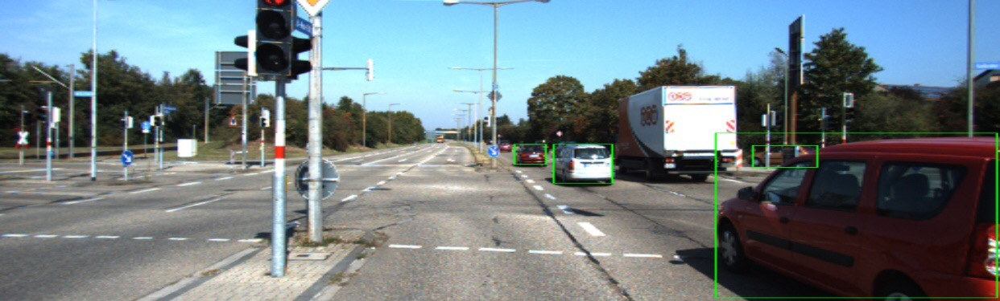

Image 1: Bounding box detection result of an image in the KITTI dataset

Our project consists of detecting the 2D bounding box locations of cars using 2D images. We aim to reproduce the results for object detection using the CenterNet framework, which uses keypoint estimation to determine the center point of the object, in the KITTI data set. Our results show that the model performs fairly well in detecting the locations of cars in the KITTI dataset, achieving similar performance as what is presented in the original CenterNet paper.

Object detection from 2D images is a very relevant and rapidly advancing problem as of today. It has many applications in the development of autonomous systems, and most notably, self-driving cars. An effective object detection system should be accurate, fast, and robust to change in relative positions, viewing angles, lighting, truncations, and occlusions. Humans instantly recognize their surrounding objects and  can  estimate the position of objects without any explicit measurement. Therefore, it is intellectually interesting and practical to investigate how a deep learning model would perform in the task of detecting objects from 2D images.