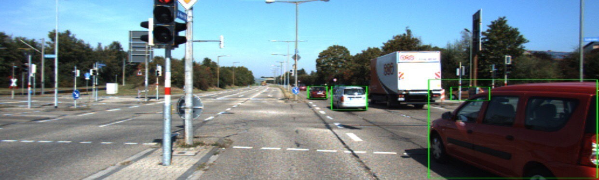

Our project consists of detecting the 2D bounding box locations of cars using 2D images. We aim to reproduce the results for object detection using the CenterNet framework, which uses keypoint estimation to determine the center point of the object, in the KITTI data set. Our results show that the model performs fairly well in detecting the locations of cars in the KITTI dataset, achieving similar performance as what is presented in the original CenterNet paper.